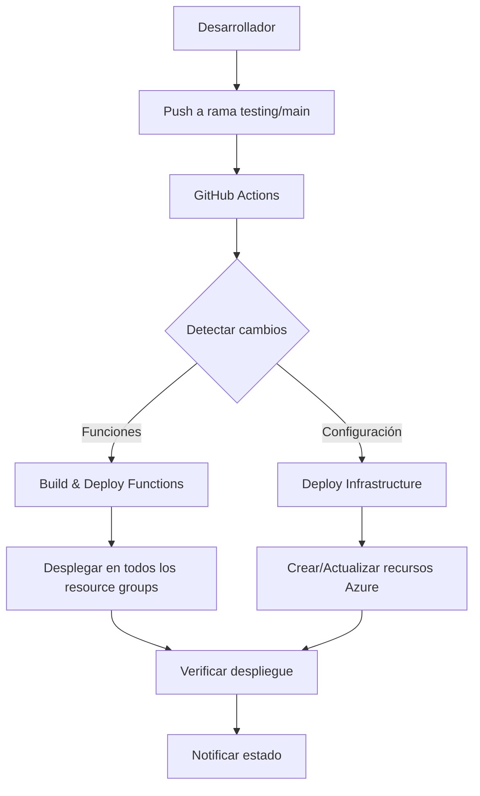

# Guía de Laboratorio DevOps - Solución Multi-Cliente

## Descripción General

Esta solución DevOps permite mantener una única base de código para múltiples clientes, con despliegue automatizado en Azure mediante GitHub Actions y Bicep. Soporta dos ambientes (testing y main) con funciones core y plugins personalizables por cliente.

## Arquitectura

### Componentes Principales

1. **Repositorio Central**: Un único repositorio que contiene todo el código
2. **Azure Functions**: Funciones core (usuarios, animales) y plugins opcionales
3. **Cosmos DB**: Base de datos NoSQL con colecciones predefinidas
4. **GitHub Actions**: Pipelines automatizados para despliegue
5. **Bicep Templates**: Infraestructura como código
6. **Configuración JSON**: Definición de clientes y ambientes

### Flujo de Trabajo



## Estructura del Proyecto

```
DevOpsLab/
├── config/
│   └── clients.json                    # Configuración de clientes
├── infrastructure/
│   └── bicep/
│       ├── main.bicep                  # Template principal
│       └── modules/
│           ├── storage.bicep           # Storage Account
│           ├── cosmosdb.bicep          # Cosmos DB
│           ├── appserviceplan.bicep    # App Service Plan
│           └── functionapp.bicep       # Function Apps
├── scripts/
│   ├── Deploy-Environment.ps1         # Script de despliegue
│   └── Add-NewClient.ps1              # Script para añadir clientes
├── .github/
│   └── workflows/
│       ├── deploy-testing.yml          # Despliegue testing
│       ├── deploy-production.yml       # Despliegue producción
│       └── deploy-infrastructure.yml   # Despliegue infraestructura
├── UsersFunction/                      # Función usuarios
├── AnimalsFunction/                    # Función animales
├── PlugginsRandomFunctionOne/          # Función plugin
└── docs/
    ├── README.md                       # Esta documentación
    └── OIDC-Setup.md                   # Configuración OIDC
```

## Configuración Inicial

### 1. Configurar Autenticación OIDC

Sigue las instrucciones en [`docs/OIDC-Setup.md`](./OIDC-Setup.md) para configurar la autenticación segura entre GitHub Actions y Azure.

### 2. Configurar Secretos en GitHub

Añade los siguientes secretos en tu repositorio GitHub:

- `AZURE_CLIENT_ID`: ID de la aplicación Azure AD
- `AZURE_TENANT_ID`: ID del tenant Azure AD
- `AZURE_SUBSCRIPTION_ID`: ID de la suscripción Azure

### 3. Personalizar Configuración

Edita `config/clients.json` para añadir tus clientes:

```json
{
  "solution": {
    "name": "witag",
    "azureSubscription": "tu-subscription-id",
    "defaultLocation": "East US"
  },
  "clients": {
    "tu-cliente": {
      "displayName": "Tu Cliente",
      "environments": {
        "testing": {
          "resourceGroup": "rg-witag-tu-cliente-testing",
          "location": "East US",
          "functions": {
            "core": ["functionUsuarios", "functionAnimales"],
            "plugins": []
          }
        }
      }
    }
  }
}
```

## Uso

### Añadir un Nuevo Cliente

#### Opción 1: Usar el Script

```powershell
# Añadir cliente con despliegue automático
./scripts/Add-NewClient.ps1 -ClientName "colflores" -DisplayName "Colflores Client" -Environment "testing" -DeployNow -SubscriptionId "tu-subscription-id"

# Añadir cliente solo a la configuración
./scripts/Add-NewClient.ps1 -ClientName "colflores" -DisplayName "Colflores Client" -Environment "testing"
```

#### Opción 2: Editar Manualmente

1. Edita `config/clients.json`
2. Añade la configuración del nuevo cliente
3. Haz commit y push a la rama correspondiente
4. El workflow de infraestructura se ejecutará automáticamente

### Desplegar un Cliente Específico

```powershell
# Desplegar ambiente testing
./scripts/Deploy-Environment.ps1 -ClientName "elite" -Environment "testing" -SubscriptionId "tu-subscription-id"

# Desplegar ambiente producción
./scripts/Deploy-Environment.ps1 -ClientName "elite" -Environment "main" -SubscriptionId "tu-subscription-id"
```

### Workflows Automatizados

#### Despliegue por Cambios de Código

- **Push a rama `testing`**: Despliega automáticamente en todos los ambientes testing
- **Push a rama `main`**: Despliega automáticamente en todos los ambientes producción
- **Pull Request**: Valida cambios sin desplegar

#### Despliegue Manual

Usa el workflow "Deploy Infrastructure" para desplegar manualmente:

1. Ve a Actions → Deploy Infrastructure
2. Selecciona "Run workflow"
3. Especifica cliente y ambiente
4. Ejecuta

## Funciones Core y Plugins

### Funciones Core

Estas funciones se despliegan para todos los clientes:

- **functionUsuarios**: Gestión de usuarios
- **functionAnimales**: Gestión de animales

### Funciones Plugin

Funciones opcionales que se pueden asignar a clientes específicos:

- **functionRandomUsuario**: Genera usuarios aleatorios
- **functionAdopcionAzar**: Funcionalidad de adopción

Para añadir un plugin a un cliente, edita `config/clients.json`:

```json
{
  "functions": {
    "core": ["functionUsuarios", "functionAnimales"],
    "plugins": ["functionRandomUsuario"]
  }
}
```

## Recursos Azure por Cliente

Cada cliente y ambiente crea los siguientes recursos:

- **Resource Group**: `rg-witag-{cliente}-{ambiente}`
- **Cosmos DB**: `cosmos-witag-{cliente}-{ambiente}`
- **Storage Account**: `stwitag{cliente}{ambiente}`
- **App Service Plan**: `asp-witag-{cliente}-{ambiente}`
- **Function Apps**: `{funcionNombre}-{cliente}-{ambiente}`

## Monitoreo y Logs

### Azure Monitor

Cada Function App tiene configurado Application Insights para:

- Métricas de rendimiento
- Logs de errores
- Trazas de ejecución

### GitHub Actions

Los workflows incluyen:

- Validación de cambios
- Verificación de despliegue
- Notificaciones de estado
- Smoke tests en producción

## Flujos de Trabajo Comunes

### Escenario 1: Nuevo Cliente

```bash
# 1. Añadir cliente a configuración
./scripts/Add-NewClient.ps1 -ClientName "nuevocliente" -DisplayName "Nuevo Cliente" -Environment "testing" -DeployNow -SubscriptionId "tu-subscription-id"

# 2. Verificar despliegue
az group show --name "rg-witag-nuevocliente-testing"

# 3. Cuando esté listo, desplegar en producción
./scripts/Deploy-Environment.ps1 -ClientName "nuevocliente" -Environment "main" -SubscriptionId "tu-subscription-id"
```

### Escenario 2: Actualizar Función

```bash
# 1. Realizar cambios en el código
# 2. Hacer commit y push a testing
git add .
git commit -m "Actualizar función usuarios"
git push origin testing

# 3. GitHub Actions desplegará automáticamente en todos los ambientes testing
# 4. Después de verificar, merge a main para producción
```

### Escenario 3: Añadir Plugin a Cliente Existente

```json
// Editar config/clients.json
{
  "clients": {
    "elite": {
      "environments": {
        "testing": {
          "functions": {
            "core": ["functionUsuarios", "functionAnimales"],
            "plugins": ["functionRandomUsuario"]  // Añadir plugin
          }
        }
      }
    }
  }
}
```

## Solución de Problemas

### Error: "Resource group not found"

**Causa**: La infraestructura no ha sido desplegada.

**Solución**: Ejecuta el script de despliegue:

```powershell
./scripts/Deploy-Environment.ps1 -ClientName "cliente" -Environment "testing" -SubscriptionId "tu-subscription-id"
```

### Error: "Function app deployment failed"

**Causa**: Problemas de compilación o configuración.

**Solución**: 
1. Verifica que el código compile localmente
2. Revisa los logs del GitHub Action
3. Verifica la configuración de la Function App en Azure

### Error: "Access denied"

**Causa**: Permisos insuficientes en Azure.

**Solución**: Verifica que el Service Principal tenga los roles necesarios:

```bash
az role assignment list --assignee $APPLICATION_ID --query "[].{Role:roleDefinitionName, Scope:scope}" --output table
```

## Mejores Prácticas

### Desarrollo

1. **Siempre desarrolla en testing primero**
2. **Usa pull requests** para cambios importantes
3. **Prueba localmente** antes de hacer push
4. **Documenta cambios** en commits descriptivos

### Despliegue

1. **Verifica la configuración** antes de añadir clientes
2. **Usa scripts** en lugar de despliegue manual
3. **Monitorea** los despliegues en Azure Portal
4. **Mantén backups** de la configuración

### Seguridad

1. **Nunca hardcodees credenciales**
2. **Usa OIDC** en lugar de secretos
3. **Revisa permisos** regularmente
4. **Monitorea actividad** inusual

## Extensibilidad

### Añadir Nuevas Funciones

1. Crea la función en una nueva carpeta
2. Añade el mapeo en `config/clients.json`:

```json
{
  "functionMappings": {
    "nuevaFuncion": {
      "path": "NuevaFuncion",
      "type": "backend"
    }
  }
}
```

3. Actualiza los workflows para incluir la nueva función

### Soporte para Múltiples Regiones

1. Añade configuración de región por cliente
2. Actualiza los templates Bicep para usar la región específica
3. Modifica los scripts para manejar múltiples regiones

## Soporte

Para problemas o preguntas:

1. Revisa la documentación en `docs/`
2. Consulta los logs de GitHub Actions
3. Verifica el estado de recursos en Azure Portal
4. Usa los scripts de verificación incluidos

## Contribución

1. Fork el repositorio
2. Crea una rama para tu feature
3. Realiza cambios y pruebas
4. Crea un pull request
5. Espera revisión y aprobación 